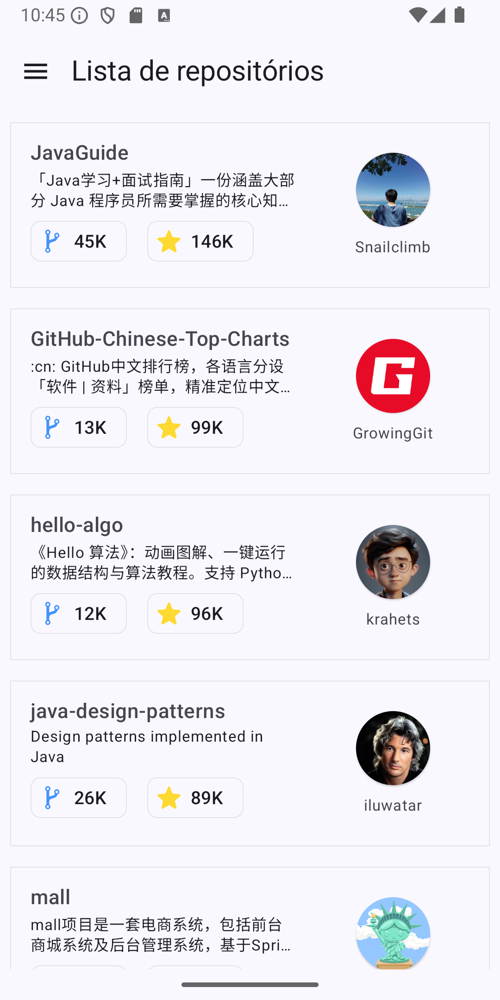
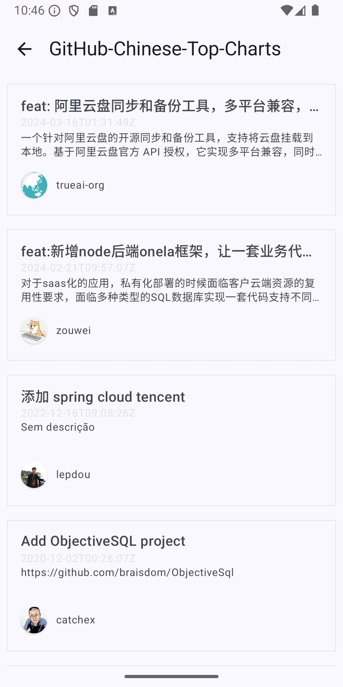

# GitHub API Android
Essa aplicação tem como objetivo implementar a 
[API do GitHub]("https://docs.github.com/en/rest?apiVersion=2022-11-28")
trazendo as funcionalidades lista de repostórios e pull requests.

# Features

## Repositórios

Lista de repositórios de Java com maior número de estrelas

    

API: https://api.github.com/search/repositories?q=language:Java&sort=stars&page=0

## Pulls

Lista de pull requests do repositório selecionado

    

API: https://api.github.com/repos/{owner}/{repo}/pulls

# Arquitetura
O Projeto foi desenvolvido em multi-módulo (aplicação e features) utilizando a 
[clean architecture]("https://medium.com/@gabrielfernandeslemos/clean-architecture-uma-abordagem-baseada-em-princ%C3%ADpios-bf9866da1f9c") 
e [MVVM]("https://en.wikipedia.org/wiki/Model%E2%80%93view%E2%80%93viewmodel")

## Módulo de aplicação
Esta dividido em duas camadas - injeção de dependência (di) e camada de apresentação (iu) - e Trás 
a integração das features, parte da injeção de dependência e a navegação entre telas

## Módulo de feature
Contém as features implementadas na aplicação (repos e pulls). Está dividido entre os pacotes de
cada feature e commons que trás o conteúdo compartilhado entre elas.
Os pacotes de feature possuem 4 camadas: data, di, domain e iu.

### data (camada de dados)
A camada de dados trata as informações que serão mostradas na camada de apresentação (iu) e esta
dividida entre as camadas dto, mapper, repository e service

#### dto
Os DTOs ou Data Transfer Objects são classes de dados em que serão utilizadas para criar os objetos
das informações obtidas na API e que serão mostradas na camada de apresentação

#### mapper
Para que as informações sejam mostradas na camada de apresentação seguindo as boas práticas de
arquitetura, utilizamos os mappers para converter os DTOs em models para que se tenha estrutura de
dados em nível de negócio.

#### repository
A camada de repositório faz a persistência dos dados para a camada de serviço (service)

#### service
A camada de serviço faz as chamadas para API e retorna o resultado obtido

### di (camada de injeção de dependência)
Trata a injeção de dependência do conteúdo utilizado no módulo

### domain (camada de domínio)
Trás as regras de negócio do projeto e esta dividída em interfaces e models

### ui (camada de apresentação)
Possui as camadas de compose (telas e componentes) e viewmodel

#### compose
Camada onde esta o conteúdo visível para o usuário e que obtém as informações por meio da viewmodel
através de programação reativa

#### viewmodel
Essa camada é reponsável por se comunicar com as camadas de dados e domínio para buscar os dados,
tratá-los e disponibilizar o conteúdo para a camada compose por meio de programação reativa

# Dependências

## Testes
- Junit
- Espresso
- Mockk

## Nativo
- Androix Lifecycle
- Androix Runtime
- Coroutines

## UI
- Jetpack Compose
- Material design
- Glide

## Injeção de dependência
- Hilt

## Network
- Retrofit
- Converter Gson

# Testes
Este projeto foi testado em nível de testes unitários e testes integrados. Para os testes unitários
foi utilizado JUnit e mockk e para os testes integrados, Espresso.

